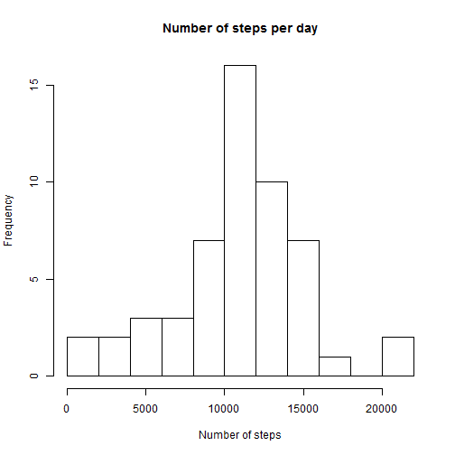
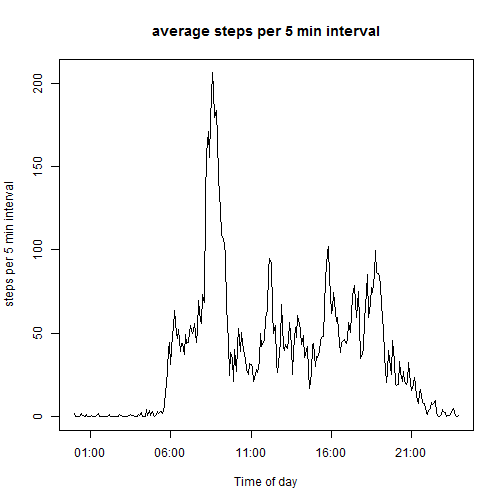
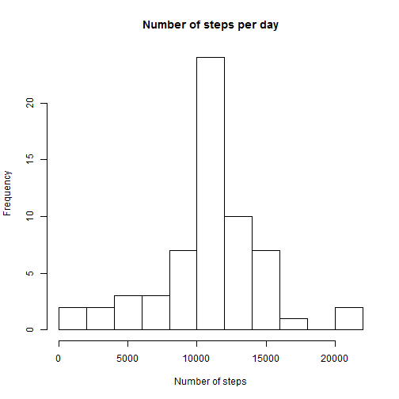
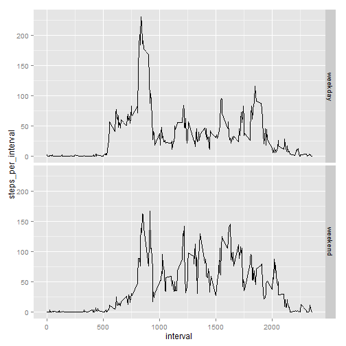

# First assignment for reproducible research course on coursera

## Libraries
Libraries used for grouping and handling dates where those earlier introduced in the
datascience spezialisaton.  

```r
library(rmarkdown)
library(dplyr)
library(ggplot2)
```
## Getting the data
Data were loaded as described in the assignment.  

```r
setInternet2(use = TRUE)
download.file(url="https://d396qusza40orc.cloudfront.net/repdata/data/activity.zip", destfile = "data.zip")
# get the name of the first file in the zip archive
fname = unzip("data.zip", list=TRUE)$Name[1]
# unzip the file to the temporary directory
unzip("data.zip", files=fname, overwrite=TRUE)
data <- read.csv(file=fname)
```
## What is mean total number of steps taken per day?
Grouping the data by date:

```r
by_date <- group_by(data,date)
by_date <- summarise(by_date,steps_per_day = sum(steps))
hist(by_date$steps_per_day, breaks = 10, xlab = "Number of steps", main = "Number of steps per day")
```

 

```r
mean_steps <- as.integer(mean(by_date$steps_per_day, na.rm = TRUE))
median_steps <- median(by_date$steps_per_day, na.rm = TRUE)
```

#### The mean number of steps per day is 10766
Note that the mean has been casted to an integer

#### Median number of steps per day 10765


## What is the average daily activity pattern?
Grouping the data by interval

```r
by_interval <- group_by(data,interval)
by_interval <- summarise(by_interval,steps_per_interval = mean(steps, na.rm = TRUE))
by_interval$time <- formatC(by_interval$interval,width=4,flag=0)
by_interval$time <- strptime(by_interval$time,format="%H%M")
plot(by_interval$time,by_interval$steps_per_interval, type = "l", ylab="steps per 5 min interval", xlab ="Time of day", main="average steps per 5 min interval")
```

 

```r
max_steps <- as.integer(max(by_interval$steps_per_interval , na.rm = TRUE))
max_interval <- which.max(by_interval$steps_per_interval)
max_time<-format(by_interval$time[max_interval],format="%H:%M")
```

#### The maximum number of steps occur in the 5 minute period preceeding 08:35

## Imputing missing values
The presence of missing values is easyly recognized from the data of the first data. 
Since a day consists of 24*12 time intervals of five minutes, data from 8 days is missing.  
Missing values were replaced by the mean for that specific interval.  This value has already been calculated for the average daily activity.  

```
## Joining by: "interval"
```

 

#### The question to answer were
- the mean value of the total number of steps taken each day based on the imputed data is **10766**.  This is a difference of 0 to the mean value of the not imputed data.
- the median value of the total number of steps taken each day based on the imputed data is **10766**.  This is a difference of 1 to the mean value of the not imputed data.

** 13% of the data is missing, and the effect is very small. This result is expected as the missingvalues has been replaced with the mean values for the intervals.** 

## Are there differences in activity patterns between weekdays and weekends?

```r
m <- weekdays(strptime(data$date,format="%Y-%m-%d"))
m <- (m == "Sonntag" | m == "Samstag")
data$daytyp <- factor(m,labels = c("weekday","weekend"))
by_interval <- group_by(data,interval,daytyp)
by_interval <- summarise(by_interval,steps_per_interval = mean(steps, na.rm = TRUE))
qplot(interval, steps_per_interval, data = by_interval, facets = daytyp~., geom = "line")
```

 


#### Comparing activities on weekend and working days####
From the plot it can be seen several differences between activity bahaviour on weekend and working days:
*on weekend the peak in the morning is missing.
*activities start later in morning on weekends.
*activities are more evenly distributed on weekends.
*there is more activities in the late evening on weekends

__so actually these results are not surprising__
